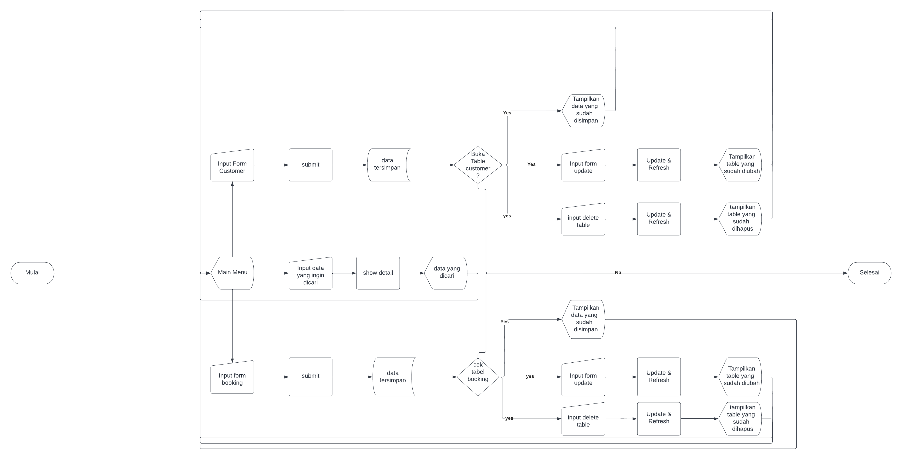

## Louvre-Hotel-Management-System 🏨
An app for fill data through python into the database (MySQL) 
from customers booking rooms. Built with Python 3, Tkinter, and MySQL.

## Authors

- [@Rizal Ramdhani](https://www.instagram.com/ramdhanirizal45/)
- [@Muhammad Fariddudin Athar](https://www.instagram.com/farid.udin25/)
- [@Abdu Malikh Silaban](https://www.instagram.com/abdumalikh/)

## Logo


## About The Project

In this project, 
we're making a CRUD application. 
The area we're going to application CRUD is a Hotel Management System. 
Where the problem we found was when the user had to input data like 
"INSERT INTO Customers (CustomerName, ContactName, Address, City, PostalCode, Country)
VALUES ('Cardinal', 'Tom B. Erichsen', 'Skagen 21', 'Stavanger', '4006', 'Norway');" that method too much take a time. So, we made user interface using Python (GUI) and the user doesn't have to make a code again. 

## Flowchart


## Built With (Tech Stack)

 - [MySQL 🐬](https://www.mysql.com/) - For handling database and queries
 - [Python 🐍](https://www.python.org/) - For running the main application code
 - [MySQL Connector Python ](https://dev.mysql.com/doc/connector-python/en/t) - For querying MySQL through python
 - [Tkinter & Tkk 🎨](https://docs.python.org/3/library/tkinter.ttk.html) - For the user interface


## Getting Started

The first thing you have to do is install this library.

```bash
!pip install mysql-connector-python
```
Or for information about installing connector to python, you can click this 


Then open the file through Visual Studio or another text editor support Python 3 and Tkinter.

<b>PS:</b> You have to put the file `MainMenu1.py`, `SearchData.py`, `Table1.py`, and `Table2.py` in same folder.

Don't forget to execute `Louvre.sql` in MySQL Workbench!

### 1. Main Menu

This is the main menu. You can fill data in form booking and form customers. After you fill data, then you can click the button "Submit". The function of button Submit is to store data in MySQL


If you want to look at the result, you can click a button on the right. There are four buttons. 
1. Button Refresh - To refresh the main menu window.
2. Button Table Customer - To look the result after you fill form Customer.
3. Button Table Booking - To look the result after you fill form Booking.
4. Button Search Data -  To search the data you want.


### 2. Window Table Customer
In the customer window, you can see the result of the table customer. After you fill data, you can update and delete some rows in the table. If you want to go back to the main menu, you click on the button "Main Menu"


### 3. Window Table Booking
In the Booking window, you can see the result of the table booking. After you fill data, you can update and delete some rows in the table. If you want to go back to the main menu, you click on the button "Main Menu"


### 4. Search Data


If you want searching data from table booking, you can type the date in format YYYY-MM-DD. after you fill the column, then click the button, and the result will come like "6 2022-06-08 {Dana}{Kamar Standar} 5 23"

Meaning

<b>6</b> - For booking_id

<b>2022-06-08</b> - The time you booked the room

<b>{Dana}</b> - For Payment Method

<b>{Kamar Standar}</b> - The type of room you booking

<b>5</b> - For nomor_kamar

<b>23</b> - For customer_no_pelanggan


### It's Done 🎉| Run The App
Run `MainMenu1.py` file with python 3 and you should see the window pop up, if you have followed each step correctly.


## Demonstration
[Youtube](https://www.youtube.com/watch?v=pCqj7PirhMw) - Video demonstration we upload on Youtube
                                                                         

## Acknowledgements 
[PyNative.com](https://pynative.com/) - Reference to look syntax python code


