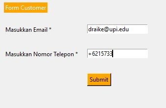
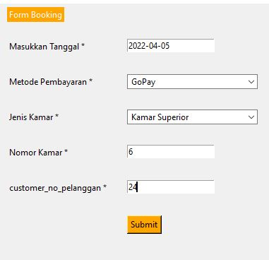
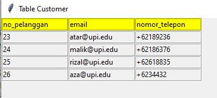
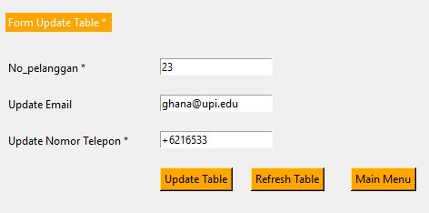
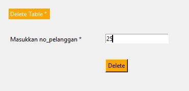
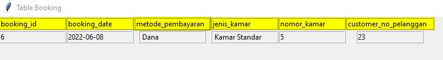
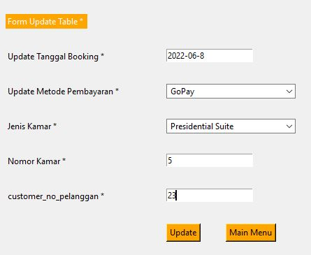
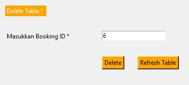
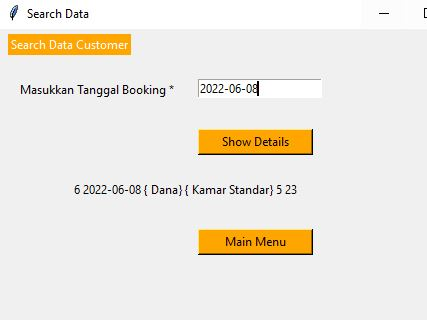

## Hotel-Louvre-Management-System 🏨
An app for fill data through python into the database (MySQL) 
from customers booking rooms.

## Logo


## About The Project

In this project, 
we're making a CRUD application. 
The area we're going to application CRUD is a Hotel Management System. 
Where the problem we found was when the user had to input data like 
"INSERT INTO Customers (CustomerName, ContactName, Address, City, PostalCode, Country)
VALUES ('Cardinal', 'Tom B. Erichsen', 'Skagen 21', 'Stavanger', '4006', 'Norway');" that method too much take a time. So, we made user interface using Python (GUI) and the user doesn't have to make a code again. 

## Built With (Tech Stack)

 - [MySQL 🐬](https://www.mysql.com/) - For handling database and queries
 - [Python 🐍](https://www.python.org/) - For running the main application code
 - [MySQL Connector Python ](https://dev.mysql.com/doc/connector-python/en/t) - For querying MySQL through python
 - [Tkinter & Tkk 🎨](https://docs.python.org/3/library/tkinter.ttk.html) - For the user interface


## Installation & How to use

The first thing you have to do is install this library.


```bash
!pip install mysql-connector-python
```
After you install, connect python to MySQL you can use this module's method to communicate with the MySQL database
```bash
import mysql.connector
```
Then open the app through Visual Studio or another text editor. 

This is the main menu. You can fill data in form booking and form customers. After you fill data, then you have to click the button "Submit". The function of button Submit is to store data in MySQL

 


If you want to look at the result, you can click a button on the right. There are four buttons. 
1. Button Refresh - To refresh the main menu window.
2. Button Table Customer - To look the result after you fill form Customer.
3. Button Table Booking - To look the result after you fill form Booking.
4. Button Search Data -  To search the data you want.

### Window Table Customer
 


### Window Table Booking
 


### Search Data



Done 🎉

## Screenshots
 
 
                                                                         

## Acknowledgements 
- [PyNative.com](https://pynative.com/) - Reference to look syntax python code


## 🔗 Links
[](https://www.linkedin.com/in/abdu-malikh-824209193/)


